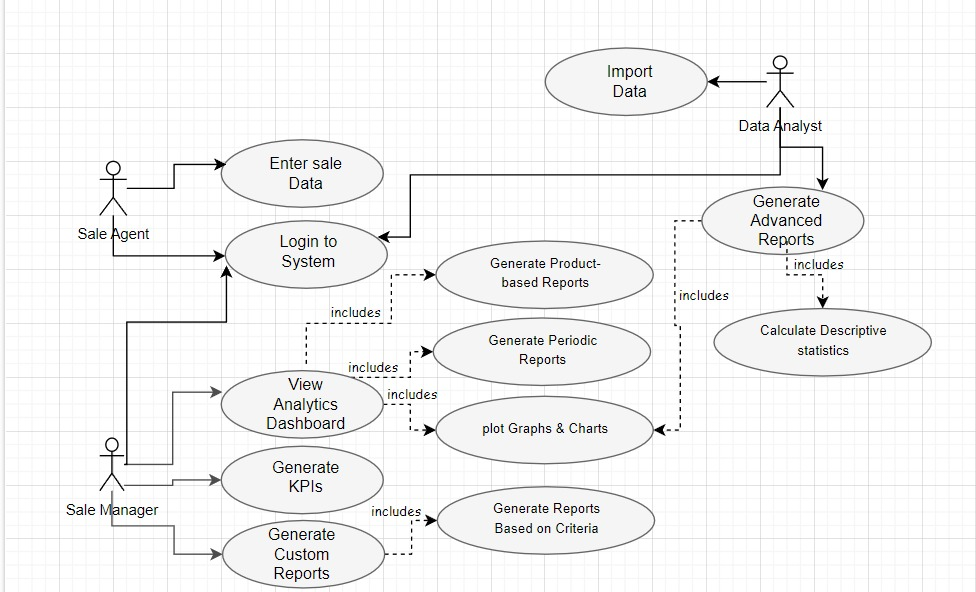

# METRICSTICS

## Introduction

Let there be a system, called METRICSTICS (a portmanteau of METRICS and STATISTICS), for finding m, M, o, d, μ, MAD, and σ. The system must take as input a random number of data values and output its descriptive statistics. The random data could be real, obtained from an authoritative source, or could be artificial, generated using a random data generator.

The purpose of the project is to create a set of interrelated artifacts for conducting certain measurements related to METRICSTICS.

In the rest of the document, ‘METRICSTICS’ stands for the name of both the project and the product, unless otherwise stated. The work on METRICSTICS has been divided into a collection of related problems. These problems have been annotated with notes, as necessary.

To implement METRICSTICS, a system to analyse sales performance has been developed. With this system, METRICSTICS allows for the statistical analysis of sales data such that the users of the system are able to make informed decisions based on the insights gained. To assist in visualizing the sales data, the system has reporting tools which allows for various customizations to suit the end user's needs.

